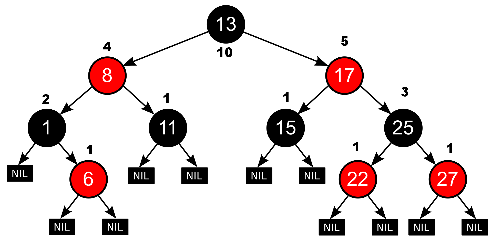

# indexed-tree-map

JDK's TreeMap / TreeSet implementation is based on the [red-black tree](https://en.wikipedia.org/wiki/Red%E2%80%93black_tree) algorithm.

**indexed-tree-map** is an enhanced version of this algorithm.

# API
    public interface IndexedNavigableSet<E> extends NavigableSet<E> {
        E exact(int index);
        int entryIndex(E e);
    }

    public interface IndexedNavigableMap<K, V> extends NavigableMap<K, V> {
        K exactKey(int index);
        Entry<K, V> exactEntry(int index);
        int keyIndex(K k);
    }

# Implementation

I added __*int weight*__ field to each node of the tree. 
It contains the number of elements below the node plus 1 (self).

Every time there is a change in the tree, weight is updated for changed nodes like this:

        void updateWeight(int delta) {
            weight += delta;
            Entry<K, V> p = parent;
            while (p != null) {
                p.weight += delta;
                p = p.parent;
            }
        }

We go from updated node to the root.

Let's take a look at the following tree. I added weight values to each node.

See how the weight of our root node is also the size of the tree (total number of elements).

So how do you get the index of an element in the tree using weights?

E.g. what is the index value of 11 in the tree above?

Let's take a look at the following method:

        // e is our element - 11
        int index = 0;
        int cmp;
        index += getWeight(e.left); // 0
        Entry<K, V> p = e.parent;
        Comparator<? super K> cpr = comparator;

        while (p != null) {
                cmp = cpr.compare(key, p.key);
                if (cmp > 0) {
                    index += getWeight(p.left) + 1;
                }
                p = p.parent;
        }

parent.left + 1 = 3 ! 

parent:8, parent.left:1, parent.left.weight=2

Index starts from 0. 11 is 4th element, so index = 3

Indeed. If we draw vertical lines through centers of each node 
we can see that lines reveal the sorted order of our tree elements.

So to get index we need to sum up parent weights to the left side of our node.

# How to use / install
There are no versions and there will be no versions. I think what's done is enough.

This library is not in the Maven repository and I currently do not have plans to put it there.

Just copy the source code into your project and use it. Or create your own Maven library. 

Or... whatever. 

# License
The same as of JDK. I copied the implementation and enhanced it. 